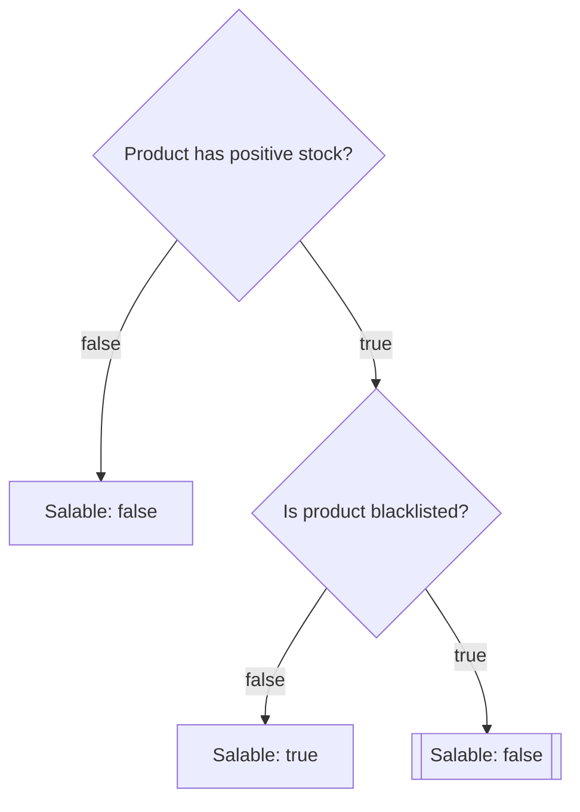

# TreeRex 🦖

[](https://github.com/bpolaszek/treerex/actions/workflows/ci.yml)
[](https://codecov.io/gh/bpolaszek/treerex)

Declaratively describe complex decision trees ("flowcharts") in YAML and run them at runtime against arbitrary subjects.


## Installation

```bash
composer require bentools/treerex
```

## Introduction
Forget about 300‑line `if/else` chains and scattered business rules: keep your logic in **one visual YAML flowchart**, keep your code tiny, and keep your future self happy! 💆‍♂️

This library lets you:

- Describe a flowchart **as YAML**, using **decision nodes** and **actions**.
- Bring your own services! Plug your own business rules by implementing `CheckerInterface`. 
- Inject your framework's PSR‑11 container so the runner can resolve your checkers (and even flowcharts) from it.
- Inspect the **runtime state** and **history** of the flowchart execution so that you know what decision nodes were reached and what their results were. ✨

### TL;DR (what you get in practice) 🫵

- ✅ **Zero if‑else spaghetti** – complex validation / eligibility logic lives in YAML, not buried in controllers.
- 🧩 **Composable rules** – re‑use the same checker services across many flowcharts.
- 🔍 **Full observability** – inspect the last node, the full decision history, and enriched context.
- 🧪 **Test‑friendly** – feed any subject + context, assert the final result and the reasons attached in context.
- 🧠 **Business‑driven** – Product Owners can reason about the YAML flowchart without reading PHP.


## Basic example

So your Product Owner came up with this diagram (it's heavily simplified...):


### 1. Implement your checkers

A checker receives the **subject**, some **criteria** (opaque to the runner), and the **context**, then returns a boolean*.

```php
namespace App\TreeRex\Checker;

use ArrayAccess;
use BenTools\TreeRex\Checker\CheckerInterface;
use Traversable;
use App\Domain\Product;
use InvalidArgumentException;

use function assert;

final class ProductChecker implements CheckerInterface
{
    /**
     * @param Product $subject
     * @param ArrayAccess<string, mixed>&Traversable<string, mixed> $context
     */
    public function satisfies(mixed $subject, mixed $criteria, ArrayAccess&Traversable $context): bool
    {
        return match ($criteria) {
            'in_stock' => $subject->stock > 0,
            'is_blacklisted' => $subject->blacklisted,
            default => throw new InvalidArgumentException(sprintf('Unknown criteria "%s".', (string) $criteria)),
        };
    }
}
```

> [!NOTE]
> * Actually, you can also return a string or an integer (see below), but using booleans is more straightforward to get started.

### 2. Write your YAML flowchart

Create a file, for instance `config/product_salable_flowchart.yaml`:

```yaml
# config/product_salable_flowchart.yaml
context: # <-- That's an optional, arbitrary array that will be passed to all decision nodes.
  reason: null

entrypoint:
  id: stock_check
  label: "Ensure product is in stock"
  checker: app.checker.product # <-- That's how your ProductChecker is registered in your DI container.
  criteria: in_stock # <-- The criteria passed to the checker.

  when@false:
    end:
      result: false
      context: # <-- This context will be merged with the root context. This is optional.
        reason: "Out of stock"

  when@true:
    id: blacklist_check
    label: "Ensure product is not blacklisted"
    checker: app.checker.product
    criteria: is_blacklisted

    when@true:
      end:
        result: false
        context:
          reason: "Product is blacklisted"

    when@false:
      end:
        result: true
        context:
          reason: "OK"
```

### 3. Instantiate and run the flowchart

```php
use ArrayObject;
use App\Domain\Product;
use App\TreeRex\Checker\ProductChecker;
use BenTools\TreeRex\Factory\TreeRexYamlFactory;
use BenTools\TreeRex\Runner\TreeRexRunner;
use BenTools\TreeRex\Utils\ServiceLocator;

require_once __DIR__.'/vendor/autoload.php';

$file = __DIR__.'/config/product_salable_flowchart.yaml';

// 1. Build the Flowchart from YAML
$flowchart = new FlowchartYamlFactory()->parseYamlFile($file);

// 2. Register your checker in a PSR‑11 container (here: simple ServiceLocator, but use your framework's DI container instead)
$container = new ServiceLocator(['app.checker.product' => new ProductChecker()]);

// 3. Create the runner
$runner = new FlowchartRunner($container);

// 4. Prepare subject and context
$product = new Product(stock: 10, blacklisted: false);
$context = new ArrayObject([ // You can put anything you want here.
    'requested_by' => 'Alice',
]);

// 5. Run the flowchart
$isSalable = $runner->satisfies($product, $flowchart, $context);

var_dump($isSalable);          // bool(true)
var_dump($context['reason']);  // "OK"
var_dump($context['_state']);  // A `RunnerState` object giving you the full history of decisions!
```

## Retrieving the flowchart state

The runner keeps track of its internal **state** in a `RunnerState` object. 
This state is always available under the special `_state` key in the **context**.

```php
use BenTools\TreeRex\Runner\RunnerState;

// After calling $runner->satisfies(...)
/** @var RunnerState $state */
$state = $context['_state'];

// Last decision node reached
$lastNode = $state->decisionNode;

// Last result for that node
$lastResult = $state->lastResult;

// History of all decisions taken
// array of [<node id>, <result>] entries
$history = $state->history;

// For example:
// [
//     ['stock_check', true],
//     ['blacklist_check', false],
// ]
```

You can enrich the context at different stages:

- Initial context – the array/`ArrayObject` you pass to `FlowchartRunner::satisfies()`.
- Flowchart root `context` – defined at the root of the YAML file (merged on top of the initial context).
- Decision‑node `context` – each node can add/override keys in the context.
- `end`, `goto`, and `error` actions can also define `context` that will be merged into the final context.

Every time the context is extended, `_state` is automatically updated to point to the latest `RunnerState` instance.

## Concepts

### Subject

The **subject** is any value you pass to `FlowchartRunner::satisfies()` (an entity, DTO, array, …). Your checkers decide what to do with it.

### Checker

A **checker** is any service implementing `BenTools\TreeRex\Checker\CheckerInterface`:

```php
interface CheckerInterface
{
    /**
     * @param ArrayAccess<string, mixed>&Traversable<string, mixed> $context
     */
    public function satisfies(mixed $subject, mixed $criteria, ArrayAccess&Traversable $context): bool;
}
```

The **criteria** are entirely up to you. They can be:

- simple strings (as shown in the `ProductChecker` example),
- arrays of conditions,
- arbitrary structured data (configuration objects, DTOs, …),
- or expressions (when using `ExpressionLanguageChecker`).

### Flowchart

A `Flowchart` is made of:

- a global `context` (optional),
- an `entrypoint` decision node,
- other decision nodes reachable through `when@true` / `when@false` or `goto`.

You normally won't construct `Flowchart` manually – instead, you:

- either build it from an **array** via `FlowchartFactory`,
- or from **YAML** via `FlowchartYamlFactory`.

### Decision node

A **decision node** describes:

- `checker` – the service id (in your container) of the checker to use.
- `id` – a unique id for the node (optional; autogenerated if missing, but required for `goto`).
- `label` – any human‑friendly label (optional).
- `criteria` – arbitrary value passed to the checker.
- `when@true` – what to do when the checker returns `true`.
- `when@false` – what to do when the checker returns `false`.
- `context` – (optional) extra context to merge when this node is evaluated.

`when@true` / `when@false` can each be:

- another decision node,
- an `end` action,
- an `error` action,
- a `goto` action,
- or omitted ("unhandled" – see below).

### Actions

There are three explicit actions:

#### `end`

Ends the flowchart and returns a boolean result.

YAML variants:

```yaml
# Short form: just a boolean result
when@true:
  end: true

# Long form: result + extra context
when@false:
  end:
    result: false
    context:
      reason: "Something went wrong"
```

#### `error`

Stops the flowchart by throwing an exception.

Short form:

```yaml
when@false:
  error: "Product should never be uncategorized"
```

Long form:

```yaml
when@false:
  error:
    message: "Custom message"
    exceptionClass: "RuntimeException"      # any RuntimeException subclass
    context:
      node: some_value # Optionally enrich context with more details
```

The thrown exception will have a `FlowchartRuntimeException` as its previous exception, which itself contains the `RunnerState`.

#### `goto`

Jumps to another decision node by id.

> [!WARNING]
> This allows you to jump to any decision node in the flowchart.
> Be cautious when using this feature, as it can easily lead to infinite loops!

Short form:

```yaml
when@true:
  goto: some_other_node_id
```

Long form, with additional context:

```yaml
when@true:
  goto:
    id: some_other_node_id
    context:
      reason: "Jumping to another part of the flowchart"
```

If the target id cannot be found, a `FlowchartRuntimeException` is thrown.

#### Unhandled steps

If a branch (`when@true` or `when@false`) is missing entirely, that branch is considered **unhandled**. When the runner reaches it, it throws an `UnhandledStepException`, which also exposes the `RunnerState`.

This simplifies your YAML definitions, but can lead to unexpected results at runtime if you forget to handle some branches.

To avoid this, you can ask `FlowchartFactory` to validate that no branches are left unhandled by passing `allowUnhandledSteps = false`:

```php
use BenTools\TreeRex\Factory\TreeRexFactory;

$factory = new FlowchartFactory();
$flowchart = $factory->create($definitionArray, allowUnhandledSteps: false);
```

## Going further

### Using the ExpressionLanguageChecker

The library ships with `ExpressionLanguageChecker`, which uses Symfony's [ExpressionLanguage component](https://symfony.com/doc/current/components/expression_language.html. 
It allows you to express criteria as strings or arrays of strings instead of writing your own checker logic.

```php
use ArrayObject;
use BenTools\TreeRex\Checker\ExpressionLanguageChecker;
use BenTools\TreeRex\Factory\TreeRexFactory;
use BenTools\TreeRex\Runner\TreeRexRunner;
use BenTools\TreeRex\Utils\ServiceLocator;
use Symfony\Component\Yaml\Yaml;

$definition = Yaml::parse(<<<'YAML'
entrypoint:
  id: stock_check
  checker: default
  criteria: product.stock > 0
  when@true:
    end: true
  when@false:
    end: false
YAML);

$flowchart = new FlowchartFactory()->create($definition);

$runner = new FlowchartRunner(new ServiceLocator([
    'default' => new ExpressionLanguageChecker('product'),
]));

$product = new Product(stock: 10, blacklisted: false);
$context = new ArrayObject();

$result = $runner->satisfies($product, $flowchart, $context);
```

Expressions have access to:

- the subject via the variable you configure (here `product`),
- the context via a `context` variable.

Example: `context.user.role === 'ADMIN' && product.stock > 0`.


### Loading flowcharts from a container

`FlowchartRunner::satisfies()` accepts either:

- a `Flowchart` instance, **or**
- a **service id** of a `Flowchart` registered in your container.

```php
use BenTools\TreeRex\Factory\TreeRexFactory;
use BenTools\TreeRex\Runner\TreeRexRunner;
use BenTools\TreeRex\Utils\ServiceLocator;
use Symfony\Component\Yaml\Yaml;

$definition = Yaml::parse(<<<'YAML'
entrypoint:
  checker: checker.default
  criteria: product.stock > 0
  when@true:
    end: true
YAML);

$factory = new FlowchartFactory();
$flowchart = $factory->create($definition);

$container = new ServiceLocator([ // <-- Ideally, this is your framework's DI container.
    'flowchart.product_is_salable' => $flowchart,
    'checker.default' => new ExpressionLanguageChecker('product'),
]);

$runner = new FlowchartRunner($container);

// Here we pass the flowchart *id* instead of the Flowchart *instance*
$result = $runner->satisfies($product, 'flowchart.product_is_salable');
```

### Declaring blocks at the root level

You can also declare blocks at the root level of the YAML file, and invoke them from decision nodes:

```yaml
blocks:
  stock_check:
    checker: app.checker.product
    criteria: product.stock > 0
  category_check:
    checker: app.checker.product
    criteria: product.category === 'electronics'
  blacklist_check:
    checker: app.checker.product
    criteria: product.blacklisted

entrypoint:
  use: stock_check
  when@true:
    use: category_check
  when@false:
    use: blacklist_check
```

### Using strings or integers instead of booleans

While this library is primarily designed for `true` / `false` decisions, 
You can also use strings or integers by providing the possible values in the `cases` config option:

```
entrypoint:
    checker: app.checker.warehouse
    criteria: product.warehouse # <-- This will return a string
    cases: ['main', 'secondary', 'offsite'] # <-- 
    when@main:
        checker: app.checker.product
        criteria: product.stock > 0
    when@secondary:
        checker: app.checker.restocking
        criteria: product.restocking
    # ...
```

## Contributing

After cloning the repository:

```bash
composer install
```

Static analysis:

```bash
composer types:check
```

Coding standards:

```bash
# Check CS issues
composer style:check

# Fix CS issues
composer style:fix
```

Run the test suite (Pest + PHPUnit) with 100% coverage requirement:

```bash
composer tests:run
```

Or run all checks (types, CS, tests) in one go: ✨

```bash
composer ci:check
```

## License

MIT.
