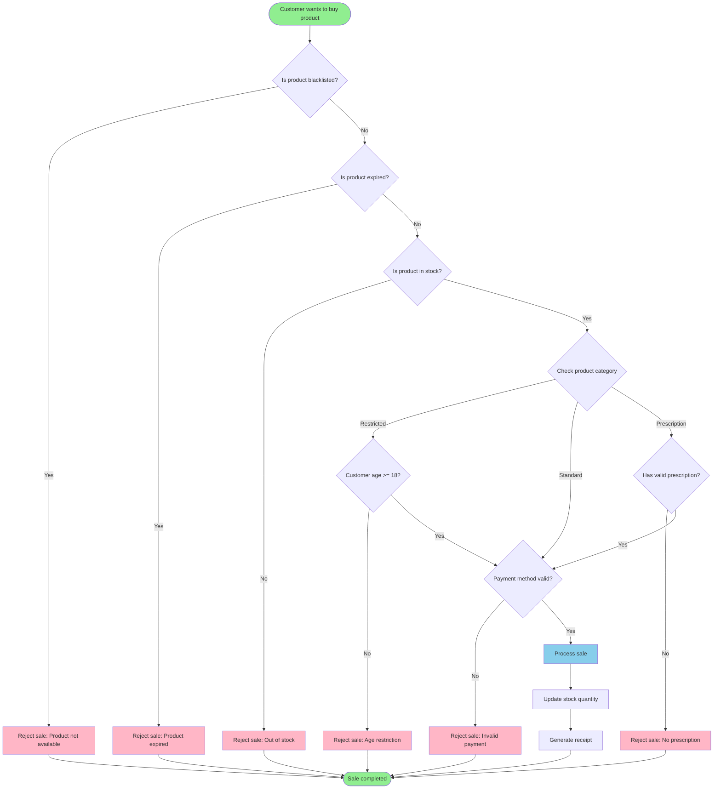

# TreeRex 🦖

Declaratively describe complex decision trees ("flowcharts") in YAML and run them at runtime against arbitrary subjects.

Forget about 300‑line `if/else` chains and scattered business rules: keep your logic in **one visual flowchart**, keep your code tiny, and keep your future self happy. 💆‍♂️

This library lets you:

- Describe a flowchart as YAML, using **decision nodes** (`when@true`, `when@false`) and **actions** (`end`, `error`, `goto`).
- Plug your own business rules by implementing `CheckerInterface` services.
- Inject any PSR‑11 container so the runner can resolve your checkers (and even flowcharts) from it.
- Inspect the **runtime state** and **history** of the flowchart execution.

### TL;DR (what you get in practice) ✨

- ✅ **Zero if‑else spaghetti** – complex validation / eligibility logic lives in YAML, not buried in controllers.
- 🧩 **Composable rules** – re‑use the same checker services across many flowcharts.
- 🔍 **Full observability** – inspect the last node, the full decision history, and enriched context.
- 🧪 **Test‑friendly** – feed any subject + context, assert the final boolean and the reasons attached in context.
- 🧠 **Business‑driven** – designers or analysts can reason about the YAML flowchart without reading PHP.

The typical workflow is:

1. Write a YAML file describing your flowchart.
2. Implement one or more checkers (services implementing `CheckerInterface`).
3. Build a `Flowchart` instance from YAML.
4. Run the flowchart with `FlowchartRunner` against a subject and a context array/`ArrayObject`.
5. Read the result (boolean) and the runner state (context key `_state`).

> For convenience, an `ExpressionLanguageChecker` is provided which relies on Symfony's ExpressionLanguage component and covers most use cases. The recommended approach, however, is to implement your own checkers and provide them through your own service container or service locator.

Think "**feature toggles / eligibility / complex validation** as a YAML flowchart" that you can refactor, test, and reason about without touching the consumers. 🚀


## From diagram to YAML: a complete example




### Equivalent YAML flowchart

Below is one way to express the same logic using this library, assuming you use the `ExpressionLanguageChecker` with:

- the subject variable named `product`, and
- a context that contains `customer`, `payment`, and `prescription` objects.

```yaml
context:
  decision: null
  reason: null

entrypoint:
  id: blacklist_check
  label: "Is product blacklisted?"
  checker: checker.default
  criteria: product.blacklisted

  when@true:
    end:
      result: false
      context:
        decision: "reject"
        reason: "Product not available"

  when@false:
    id: expiry_check
    label: "Is product expired?"
    checker: checker.default
    criteria: product.expired

    when@true:
      end:
        result: false
        context:
          decision: "reject"
          reason: "Product expired"

    when@false:
      id: stock_check
      label: "Is product in stock?"
      checker: checker.default
      criteria: product.stock > 0

      when@false:
        end:
          result: false
          context:
            decision: "reject"
            reason: "Out of stock"

      when@true:
        id: category_restricted
        label: "Is category restricted?"
        checker: checker.default
        criteria: product.category == 'restricted'

        # Restricted category → customer must be >= 18
        when@true:
          id: age_check
          label: "Customer age >= 18?"
          checker: checker.default
          criteria: context.customer.age >= 18

          when@false:
            end:
              result: false
              context:
                decision: "reject"
                reason: "Age restriction"

          when@true:
            goto: payment_check

        # Not restricted → either standard or prescription
        when@false:
          id: category_standard
          label: "Is category standard?"
          checker: checker.default
          criteria: product.category == 'standard'

          # Standard category → go straight to payment check
          when@true:
            goto: payment_check

          # Otherwise we expect a prescription category
          when@false:
            id: category_prescription
            label: "Is category prescription?"
            checker: checker.default
            criteria: product.category == 'prescription'

            when@false:
              end:
                result: false
                context:
                  decision: "reject"
                  reason: "Unsupported category"

            when@true:
              id: prescription_check
              label: "Has valid prescription?"
              checker: checker.default
              criteria: context.prescription.valid

              when@false:
                end:
                  result: false
                  context:
                    decision: "reject"
                    reason: "No valid prescription"

              when@true:
                goto: payment_check

          # Shared payment check for all accepted categories
payment_check:
  id: payment_check
  label: "Is payment method valid?"
  checker: checker.default
  criteria: context.payment.valid

  when@false:
    end:
      result: false
      context:
        decision: "reject"
        reason: "Invalid payment"

  when@true:
    end:
      result: true
      context:
        decision: "accept"
        reason: "Sale completed"
```

Notes:

- Each **decision node** corresponds to a diamond in the Mermaid diagram.
- Each **reject** box becomes an `end` action with `result: false` and a human‑readable `reason` in the context.
- The **success path** (process sale → update stock → generate receipt → end) is modeled as a single `end` action with `result: true`; your application can then:
  - look at `decision` / `reason` in the context, and
  - perform `ProcessSale`, `UpdateStock`, and `GenerateReceipt` as regular application code after the flowchart completes.
- The fan‑out on `CheckCategory` (Restricted / Standard / Prescription) is expressed as a small chain of decision nodes (`category_restricted`, `category_standard`, `category_prescription`) plus shared nodes (`age_check`, `prescription_check`, `payment_check`) that are reused via `goto`.


## Installation

Requires **PHP 8.4+**.

Install via Composer:

```bash
composer require bentools/flowchart
```

This will also install the following main dependencies:

- `psr/container` – for the service locator / container integration.
- `symfony/yaml` – to load flowcharts from YAML files.
- `symfony/options-resolver` – to validate and normalize flowchart definitions.
- `symfony/expression-language` – used by the built‑in `ExpressionLanguageChecker`.


## Basic example

This example shows:

- a simple **YAML flowchart**,
- a custom **`CheckerInterface` implementation**,
- how to **instantiate** everything and run the flowchart with a subject and a context.

### 1. Define your domain model

```php
namespace App\Domain;

final class Product
{
    public function __construct(
        public int $stock,
        public bool $blacklisted,
    ) {
    }
}
```

### 2. Create a checker

A checker receives the **subject**, some **criteria** (opaque to the runner), and the **context**, then returns a boolean.

```php
namespace App\TreeRex\Checker;

use ArrayAccess;
use BenTools\TreeRex\Checker\CheckerInterface;
use Traversable;
use App\Domain\Product;
use InvalidArgumentException;

use function assert;

final class ProductChecker implements CheckerInterface
{
    /**
     * @param ArrayAccess<string, mixed>&Traversable<string, mixed> $context
     */
    public function satisfies(mixed $subject, mixed $criteria, ArrayAccess&Traversable $context): bool
    {
        assert($subject instanceof Product);

        return match ($criteria) {
            'in_stock' => $subject->stock > 0,
            'is_blacklisted' => $subject->blacklisted,
            default => throw new InvalidArgumentException(sprintf('Unknown criteria "%s".', (string) $criteria)),
        };
    }
}
```

### 3. Write the YAML flowchart

Create a file, for instance `config/flowcharts/product_is_salable.yaml`:

```yaml
context: # <-- That's an optional, arbitrary array that will be passed to all decision nodes.
  reason: null

entrypoint:
  id: stock_check
  label: "Ensure product is in stock"
  checker: app.checker.product # <-- That's how your ProductChecker is registered in your DI container.
  criteria: in_stock # <-- The criteria passed to the checker.

  when@false:
    end:
      result: false
      context: # <-- This context will be merged with the root context. This is optional.
        reason: "Out of stock"

  when@true:
    id: blacklist_check
    label: "Ensure product is not blacklisted"
    checker: app.checker.product
    criteria: is_blacklisted

    when@true:
      end:
        result: false
        context:
          reason: "Product is blacklisted"

    when@false:
      end:
        result: true
        context:
          reason: "OK"
```

What this flowchart does:

1. Check `in_stock` on the product.
   - If **no**, end the flowchart with `false` and set `reason = "Out of stock"`.
2. If **yes**, check `is_blacklisted`.
   - If **yes**, end with `false` and `reason = "Product is blacklisted"`.
   - If **no**, end with `true` and `reason = "OK"`.

### 4. Instantiate and run the flowchart

```php
use ArrayObject;
use App\Domain\Product;
use App\TreeRex\Checker\ProductChecker;
use BenTools\TreeRex\Factory\TreeRexYamlFactory;
use BenTools\TreeRex\Runner\TreeRexRunner;
use BenTools\TreeRex\Utils\ServiceLocator;

require_once __DIR__.'/vendor/autoload.php';

// 1. Build the Flowchart from YAML
$yamlFactory = new FlowchartYamlFactory();
$flowchart = $yamlFactory->parseYamlFile(
    __DIR__.'/config/flowcharts/product_is_salable.yaml',
);

// 2. Register your checker in a PSR‑11 container (here: simple ServiceLocator, but use your framework's DI container instead)
$container = new ServiceLocator([
    'app.checker.product' => new ProductChecker(),
]);

// 3. Create the runner
$runner = new FlowchartRunner($container);

// 4. Prepare subject and context
$product = new Product(stock: 10, blacklisted: false);
$context = new ArrayObject([
    // You can put anything you want here.
    'requested_by' => 'alice',
]);

// 5. Run the flowchart
$isSalable = $runner->satisfies($product, $flowchart, $context);

var_dump($isSalable);          // bool(true)
var_dump($context['reason']);  // "OK"
```


## Retrieving the flowchart state

The runner keeps track of its internal **state** in a `RunnerState` object. This state is always available under the special `_state` key in the **context**.

```php
use BenTools\TreeRex\Runner\RunnerState;

// After calling $runner->satisfies(...)
/** @var RunnerState $state */
$state = $context['_state'];

// Last decision node reached
$lastNode = $state->decisionNode;    // BenTools\TreeRex\Definition\DecisionNode

// Last result (bool) for that node
$lastResult = $state->lastResult;    // bool

// History of all decisions taken
// array of [<node id>, <bool result>] entries
$history = $state->history;

// For example:
// [
//     ['stock_check', true],
//     ['blacklist_check', false],
// ]
```

You can enrich the context at different stages:

- Initial context – the array/`ArrayObject` you pass to `FlowchartRunner::satisfies()`.
- Flowchart root `context` – defined at the root of the YAML file (merged on top of the initial context).
- Decision‑node `context` – each node can add/override keys in the context.
- `end` and `error` actions can also define `context` that will be merged into the final context.

Every time the context is extended, `_state` is automatically updated to point to the latest `RunnerState` instance.


## Concepts

### Subject

The **subject** is any value you pass to `FlowchartRunner::satisfies()` (an entity, DTO, array, …). Your checkers decide what to do with it.

### Checker

A **checker** is any service implementing `BenTools\TreeRex\Checker\CheckerInterface`:

```php
interface CheckerInterface
{
    /**
     * @param ArrayAccess<string, mixed>&Traversable<string, mixed> $context
     */
    public function satisfies(mixed $subject, mixed $criteria, ArrayAccess&Traversable $context): bool;
}
```

The **criteria** are entirely up to you. They can be:

- simple strings (as shown in the `ProductChecker` example),
- arrays of conditions,
- arbitrary structured data (configuration objects, DTOs, …),
- or expressions (when using `ExpressionLanguageChecker`).

### Flowchart

A `Flowchart` is made of:

- a global `context` (optional),
- an `entrypoint` decision node,
- other decision nodes reachable through `when@true` / `when@false` or `goto`.

You normally won't construct `Flowchart` manually – instead, you:

- either build it from an **array** via `FlowchartFactory`,
- or from **YAML** via `FlowchartYamlFactory`.

### Decision node

A **decision node** describes:

- `checker` – the service id (in your container) of the checker to use.
- `id` – a unique id for the node (optional; autogenerated if missing, but required for `goto`).
- `label` – any human‑friendly label.
- `criteria` – arbitrary value passed to the checker.
- `when@true` – what to do when the checker returns `true`.
- `when@false` – what to do when the checker returns `false`.
- `context` – (optional) extra context to merge when this node is evaluated.

`when@true` / `when@false` can each be:

- another decision node (array),
- an `end` action,
- an `error` action,
- a `goto` action,
- or omitted ("unhandled" – see below).

### Actions

There are three explicit actions:

#### `end`

Ends the flowchart and returns a boolean result.

YAML variants:

```yaml
# Short form: just a boolean result
when@true:
  end: true

# Long form: result + extra context
when@false:
  end:
    result: false
    context:
      reason: "Something went wrong"
```

#### `error`

Stops the flowchart by throwing an exception.

Short form:

```yaml
when@false:
  error: "Product should never be uncategorized"
```

Long form:

```yaml
when@false:
  error:
    message: "Custom message"
    exceptionClass: "RuntimeException"      # any RuntimeException subclass
    context:
      node: some_value # Optionally enrich context with more details
```

The thrown exception will have a `FlowchartRuntimeException` as its previous exception, which itself contains the `RunnerState`.

#### `goto`

Jumps to another decision node by id.

> [!WARNING]
> This allows you to jump to any decision node in the flowchart.
> Be cautious when using this feature, as it can easily lead to infinite loops!

Short form:

```yaml
when@true:
  goto: some_other_node_id
```

Long form, with additional context:

```yaml
when@true:
  goto:
    id: some_other_node_id
    context:
      reason: "Jumping to another part of the flowchart"
```

If the target id cannot be found, a `FlowchartRuntimeException` is thrown.

#### Unhandled steps

If a branch (`when@true` or `when@false`) is missing entirely, that branch is considered **unhandled**. When the runner reaches it, it throws an `UnhandledStepException`, which also exposes the `RunnerState`.

This simplifies your YAML definitions, but can lead to unexpected results at runtime if you forget to handle some branches.

To avoid this, you can ask `FlowchartFactory` to validate that no branches are left unhandled by passing `allowUnhandledSteps = false`:

```php
use BenTools\TreeRex\Factory\TreeRexFactory;

$factory = new FlowchartFactory();
$flowchart = $factory->create($definitionArray, allowUnhandledSteps: false);
```


## Using the ExpressionLanguageChecker

The library ships with `ExpressionLanguageChecker`, which uses Symfony's [ExpressionLanguage component](https://symfony.com/doc/current/components/expression_language.html. 
It allows you to express criteria as strings or arrays of strings instead of writing your own checker logic.

```php
use ArrayObject;
use BenTools\TreeRex\Checker\ExpressionLanguageChecker;
use BenTools\TreeRex\Factory\TreeRexFactory;
use BenTools\TreeRex\Runner\TreeRexRunner;
use BenTools\TreeRex\Utils\ServiceLocator;
use Symfony\Component\Yaml\Yaml;

$definition = Yaml::parse(<<<'YAML'
entrypoint:
  id: stock_check
  checker: default
  criteria: product.stock > 0
  when@true:
    end: true
  when@false:
    end: false
YAML);

$flowchart = (new FlowchartFactory())->create($definition);

$runner = new FlowchartRunner(new ServiceLocator([
    'default' => new ExpressionLanguageChecker('product'),
]));

$product = new \App\Domain\Product(stock: 10, blacklisted: false);
$context = new ArrayObject();

$result = $runner->satisfies($product, $flowchart, $context);
```

Expressions have access to:

- the subject via the variable you configure (here `product`),
- the context via a `context` variable.

Example: `context.user.role === 'ADMIN' && product.stock > 0`.


## Loading flowcharts from a container

`FlowchartRunner::satisfies()` accepts either:

- a `Flowchart` instance, **or**
- a **service id** of a `Flowchart` registered in your container.

```php
use BenTools\TreeRex\Factory\TreeRexFactory;
use BenTools\TreeRex\Runner\TreeRexRunner;
use BenTools\TreeRex\Utils\ServiceLocator;
use Symfony\Component\Yaml\Yaml;

$definition = Yaml::parse(<<<'YAML'
entrypoint:
  checker: checker.default
  criteria: product.stock > 0
  when@true:
    end: true
YAML);

$factory = new FlowchartFactory();
$flowchart = $factory->create($definition);

$container = new ServiceLocator([
    'flowchart.product_is_salable' => $flowchart,
    'checker.default' => new ExpressionLanguageChecker('product'),
]);

$runner = new FlowchartRunner($container); // <-- Ideally, this is your framework's DI container.

// Here we pass the flowchart *id* instead of the Flowchart instance
$result = $runner->satisfies($product, 'flowchart.product_is_salable');
```


## Running tests (for contributors)

After cloning the repository:

```bash
composer install
```

Static analysis:

```bash
composer types:check
```

Coding standards:

```bash
composer style:check

# or to fix CS issues automatically
composer style:fix
```

Run the test suite (Pest + PHPUnit) with 100% coverage requirement:

```bash
composer tests:run
```

Or run all checks (types, CS, tests) in one go:

```bash
composer ci:check
```

## License

MIT.
