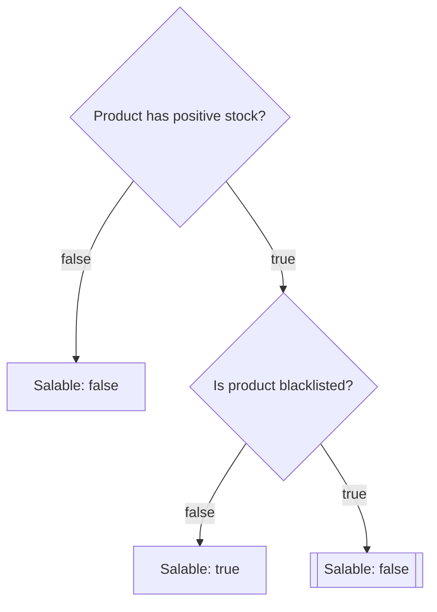

# Getting started 🚀

TreeRex lets you declaratively describe complex decision trees ("flowcharts") in **YAML** and run them at runtime against arbitrary subjects.

Forget about 300‑line `if/else` chains and scattered business rules: keep your logic in **one visual YAML flowchart**, keep your code tiny, and keep your future self happy! 💆‍♂️

This library lets you:

- Describe a flowchart **as YAML**, using **decision nodes** and **actions**.
- Bring your own services! Plug your own business rules by implementing `CheckerInterface`.
- Inject your framework's PSR‑11 container so the runner can resolve your checkers (and even flowcharts) from it.
- Inspect the **runtime state** and **history** of the flowchart execution so that you know what decision nodes were reached and what their results were. ✨

---

## Your first flowchart 🧪

So your Product Owner came up with this diagram (it's heavily simplified...):



We'll translate it into:

1. A **checker** that knows how to evaluate business rules.
2. A **YAML flowchart** describing the decision tree.
3. A bit of **bootstrap code** that wires everything and runs the flowchart.

### 1. Implement your checker ✅

A checker receives the **subject**, some **criteria** (opaque to the runner), and the **context**, then returns a boolean*.

```php
namespace App\TreeRex\Checker;

use ArrayAccess;
use BenTools\TreeRex\Checker\CheckerInterface;
use Traversable;
use App\Domain\Product;
use InvalidArgumentException;

final class ProductChecker implements CheckerInterface
{
    /**
     * @param Product $subject
     */
    public function satisfies(mixed $subject, mixed $criteria, ArrayAccess&Traversable $context): bool
    {
        return match ($criteria) {
            'in_stock' => $subject->stock > 0,
            'is_blacklisted' => $subject->blacklisted,
            default => throw new InvalidArgumentException(sprintf('Unknown criteria "%s".', (string) $criteria)),
        };
    }
}
```

> [!NOTE]
> * Actually, you can also return a string or an integer (see below), but using booleans is more straightforward to get started.

### 2. Write your YAML flowchart 📜

Create a file, for instance `config/product_salable_flowchart.yaml`:

```yaml
# config/product_salable_flowchart.yaml
context: # <-- That's an optional, arbitrary array that will be passed to all decision nodes.
  reason: null

entrypoint:
  id: stock_check
  label: "Ensure product is in stock"
  checker: app.checker.product # <-- That's how your ProductChecker is registered in your DI container.
  criteria: in_stock # <-- The criteria passed to the checker.

  when@false:
    end:
      result: false
      context: # <-- This context will be merged with the root context. This is optional.
        reason: "Out of stock"

  when@true:
    id: blacklist_check
    label: "Ensure product is not blacklisted"
    checker: app.checker.product
    criteria: is_blacklisted

    when@true:
      end:
        result: false
        context:
          reason: "Product is blacklisted"

    when@false:
      end:
        result: true
        context:
          reason: "OK"
```

### 3. Instantiate and run the flowchart 🏃

```php
use ArrayObject;
use App\Domain\Product;
use App\TreeRex\Checker\ProductChecker;
use BenTools\TreeRex\Factory\TreeRexYamlFactory;
use BenTools\TreeRex\Runner\TreeRexRunner;
use BenTools\TreeRex\Utils\ServiceLocator;

require_once __DIR__.'/vendor/autoload.php';

$file = __DIR__.'/config/product_salable_flowchart.yaml';

// 1. Build the Flowchart from YAML
$flowchart = new FlowchartYamlFactory()->parseYamlFile($file);

// 2. Register your checker in a PSR‑11 container (here: simple ServiceLocator, but use your framework's DI container instead)
$container = new ServiceLocator(['app.checker.product' => new ProductChecker()]);

// 3. Create the runner
$runner = new FlowchartRunner($container);

// 4. Prepare subject and context
$product = new Product(stock: 10, blacklisted: false);
$context = new ArrayObject([ // You can put anything you want here.
    'requested_by' => 'Alice',
]);

// 5. Run the flowchart
$isSalable = $runner->satisfies($product, $flowchart, $context);

var_dump($isSalable);          // bool(true)
var_dump($context['reason']);  // "OK"
var_dump($context['_state']);  // A `RunnerState` object giving you the full history of decisions!
```

---

⬅️ Previous: [Overview](../README.md)  
➡️ Next: [Flowchart state & context](02-flowchart-state.md)
